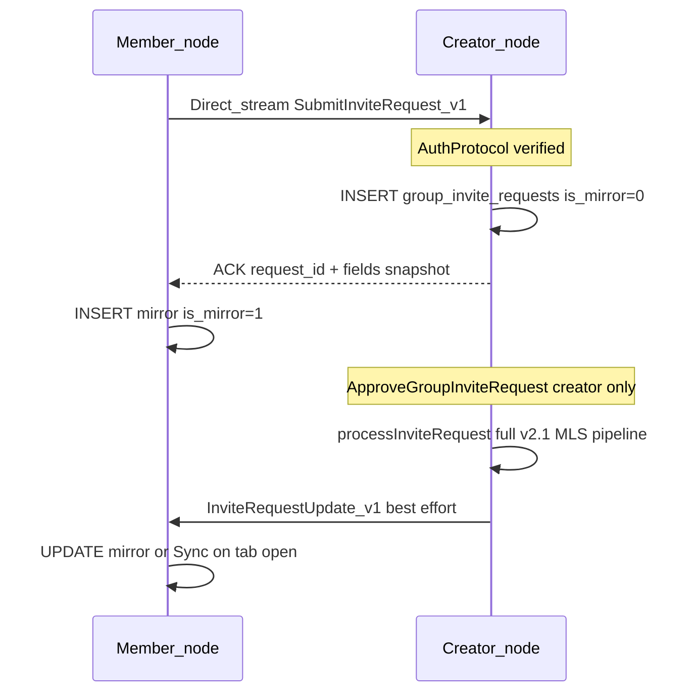

# Kế hoạch: Mời thành viên + duyệt đa node (creator_approval) — bản cập nhật theo review

## Bối cảnh & lỗi gốc

- Queue `group_invite_requests` hiện chỉ đúng trên node tạo request; creator không thấy hàng chờ; event Wails là local.
- Hướng tổng thể giữ nguyên: **DB creator = source of truth** cho duyệt; direct stream P2P theo pattern [`group_info_sync.go`](app/service/group_info_sync.go).

---

## Quyết định thiết kế (từ review)

### 1. `client_nonce` và idempotent retry

**Quyết định (thesis): không thêm cột `client_nonce`.**

- Idempotent thực tế đã có nhờ partial unique index `(group_id, target_peer_id) WHERE status IN ('pending','processing')` trên [`group_invite_requests`](app/adapter/store/db.go).
- Retry submit trùng target → INSERT conflict → trả lỗi dạng duplicate/active request (đã có pattern map `unique` trong [`RequestGroupInvite`](app/service/group_invite_requests.go)).
- Wire protocol **không bắt buộc** field nonce; nếu sau này cần retry semantics tinh hơn có thể thêm cột + lookup (ghi chú trong backlog, không làm trong sprint này).

### 2. Mirror row trên member — **bắt buộc làm rõ trong schema và job**

- **Cùng bảng** `group_invite_requests` để `ListGroupInviteRequests` / UI không đổi model.
- Thêm cột ví dụ: `is_mirror INTEGER NOT NULL DEFAULT 0` (0 = bản ghi thật trên creator hoặc bản ghi do creator tạo; 1 = bản sao trên member chỉ để UI).
- Member sau khi nhận ACK từ creator: `INSERT` mirror với `is_mirror = 1`, cùng `request_id` canonical.
- **Mọi job/sweep** chỉ xử lý bản ghi “authority” trên máy đó:
  - [`FailStaleProcessingInviteRequests`](app/adapter/store/group_invite_requests.go), `FailCorruptProcessingInviteRequests`, `ExpirePendingInviteRequests`: thêm điều kiện **`AND is_mirror = 0`** để mirror không bị timeout/expiry sai trạng thái so với creator.
- Logic approve/process MLS **chỉ** chạy trên creator (`is_mirror = 0` trên DB creator); mirror không gọi `processInviteRequest`.

### 3. Creator offline — spec hành vi tối thiểu

- Nếu không mở được stream tới creator peer (dial fail, timeout, no route): `RequestGroupInvite` trả lỗi có mã ổn định **`ERR_CREATOR_UNREACHABLE`** (hoặc prefix thống nhất với các `ERR_*` hiện có).
- UI: hiển thị **"Không thể liên hệ người tạo nhóm, thử lại sau."** (map từ mã lỗi trong [`formatSendError`](app/frontend/src/lib/formatSendError.ts) hoặc tương đương).

### 4. Push thất bại khi requester offline lúc creator approve

- Push `InviteRequestUpdateV1` có thể fail → mirror trên member có thể kẹt `pending`.
- **Spec tối thiểu:** khi user **mở** khu vực UI danh sách yêu cầu mời / tab “Yêu cầu tham gia” (Invite requests trong [`RoomPanel`](app/frontend/src/components/chat/RoomPanel.tsx) hoặc hook tương ứng), frontend gọi **một lần** API sync/pull để làm mới trạng thái từ creator (không bắt buộc background polling).

### 5. Resolve creator peer thất bại (member mới join)

- `ListGroupMembers` + `role = creator` có thể **rỗng** nếu metadata chưa sync.
- Trả lỗi có mã **`ERR_GROUP_CREATOR_UNKNOWN`** (hoặc tương đương), message: **"Chưa đồng bộ đủ thông tin nhóm."** — không panic, không dial peer rỗng.

### 6. MLS trong diagram / wording

- Cụm **"Approve locally → processInviteRequest"** trong sequence không chỉ là một bước: đó là **toàn bộ state machine / MLS pipeline đã mô tả trong v2.1** (KeyPackage, Add proposal, Commit, deliver Welcome, v.v.). Plan implementation **không** thay thế tài liệu v2.1; chỉ nối submit/approve đa node vào chỗ hiện có.

### 7. Pull / `SyncInviteRequest` — phạm vi thesis

- **Không** đặt ra protocol pull riêng phức tạp là yêu cầu bắt buộc.
- **Trong scope:** một method runtime kiểu **`SyncInviteRequestFromCreator(request_id)`** (hoặc sync theo `group_id`) — một shot qua direct stream, trả snapshot terminal/pending; gọi từ bước (4) khi mở tab.
- **Ngoài scope:** polling định kỳ, offline queue phía member.

### 8. Validation `target_peer_id` phía creator

- **Giả định:** UI chỉ chọn peer từ danh sách đã biết (bootstrap/DHT/profile). Handler creator kiểm tra cú pháp `peer.Decode`; không yêu cầu "peer phải online" cho thesis.
- Ghi rõ assumption trong comment/service doc ngắn.

### 9. Teardown handler — **đã xác nhận codebase**

- [`registerGroupInfoHandler`](app/service/group_info_sync.go) có đôi **`removeGroupInfoHandler`**.
- [`stopNetworkLocked`](app/service/runtime.go) gọi `r.removeGroupInfoHandler()` cùng các `remove*Handler` khác khi tắt node.
- Handler mới **phải** có `register…` / `remove…` tương ứng và được gọi trong cùng chỗ (launch P2P / `stopNetworkLocked`).

---

## Kiến trúc luồng (cập nhật)

---

## File / vùng chạm chính

- [`app/adapter/store/db.go`](app/adapter/store/db.go) — migration thêm `is_mirror`; cập nhật `GroupInviteRequestRecord`, CRUD, và **mọi** query sweep.
- [`app/adapter/p2p/`](app/adapter/p2p/) — protocol ID + frame Submit/Response/Update (tối giản).
- [`app/service/group_invite_requests.go`](app/service/group_invite_requests.go) — nhánh member `creator_approval`, mirror insert, sync method.
- [`app/service/runtime.go`](app/service/runtime.go) — register/remove stream handler.
- Frontend — map `ERR_*`, trigger sync khi mở invite-requests UI.

---

## Kiểm thử

- Go tests: sweep chỉ ảnh hưởng `is_mirror = 0`; mirror không bị expire sai.
- Manual 3-node + creator tắt/mở + push fail + mở tab sync.

---

## TODO triển khai (giữ nguyên hướng, chi tiết hóa)

1. Schema + store: `is_mirror`, sweep filters, mirror insert path.
2. P2P wire + creator handler + member submit + teardown đối xứng runtime.
3. Push update + `SyncInviteRequestFromCreator` + FE tab-open trigger + error codes.
4. `go test ./...`, `npm run build`, kịch bản manual.
