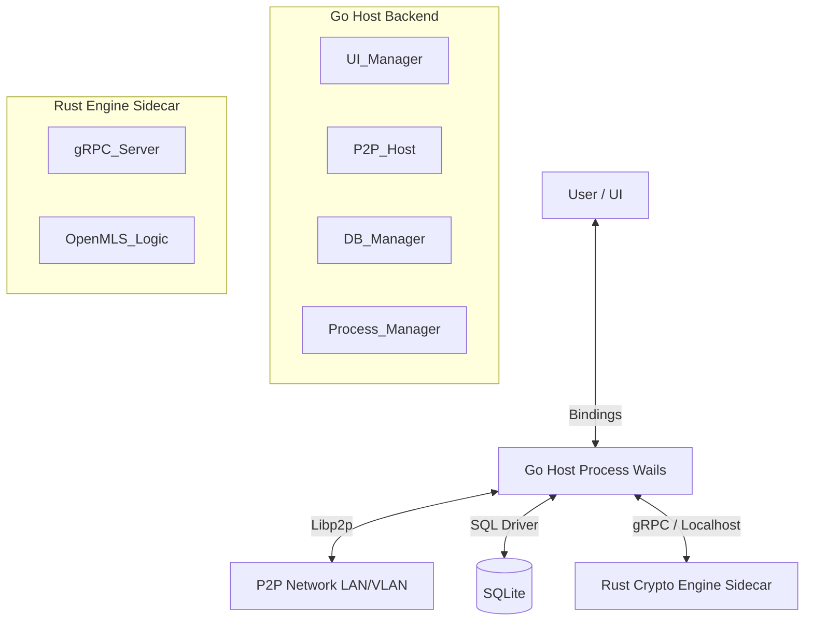

# SECURE PRIVATE P2P COMMUNICATION SYSTEM (THESIS PROJECT)

> **CONTEXT FOR AI AGENTS:** This project is a **Graduation Thesis** focused on building a serverless, zero-trust internal communication platform for high-security organizations. It utilizes **Pure P2P** architecture combined with the **MLS (Messaging Layer Security)** protocol.
>
> **CORE ARCHITECTURE:** Sidecar Pattern. A **Go** host application manages a headless **Rust** cryptographic engine via gRPC over localhost.
>
> **IMPORTANT NOTE FOR AI AGENTS:** When implementing features, always refer to `PROJECT_PLAN.md` for the specific phase and task details. Prioritize Security and Consistency over Performance.

## 1. SYSTEM ARCHITECTURE

The system follows a **Local-First, Sidecar Architecture** where the UI and Networking logic are decoupled from the Cryptographic Engine.

### 1.1. High-Level Diagram



### 1.2. Component Responsibilities

*   **Frontend (React/TS):** Renders UI, handles user input, communicates with Go via Wails Runtime.
*   **Backend (Go - Wails):**
    *   **Process Manager:** Spawns the Rust binary on a random ephemeral port and manages its lifecycle (Start/Stop).
    *   **Networking:** Manages Libp2p Host, DHT, GossipSub, and mDNS.
    *   **Persistence:** Manages SQLite database (User profiles, Chat history, KV Store).
    *   **Orchestrator:** Acts as the bridge between UI, Network, and Crypto Engine.
*   **Crypto Engine (Rust - OpenMLS):**
    *   **Stateless Service:** Does not access the disk directly. Receives state from Go, processes it, and returns the result.
    *   **MLS Logic:** Handles Group creation, Commit generation, Key rotation, Encryption/Decryption.
    *   **Interface:** Exposes a gRPC Service (Protobuf).

## 2. TECHNICAL STACK & CONSTRAINTS

### 2.1. Core Technologies

*   **App Framework:** Wails v2 (Go + Webview).
*   **Networking:** go-libp2p (TCP, QUIC, Noise, Yamux, GossipSub, Kademlia DHT).
*   **Cryptography:** `openmls` (Rust crate) served via `tonic` (gRPC).
*   **Database:** SQLite (embedded via Go).
*   **Protocol Buffers:** Used for IPC between Go and Rust.

### 2.2. Critical Implementation Rules (DO NOT VIOLATE)

*   **Sidecar Pattern:** The Rust binary MUST NOT be started manually. The Go app MUST spawn it using `os/exec` and pass the listening port via CLI flag (e.g., `--port 12345`).
*   **Stateless Rust:** The Rust engine MUST NOT store state (Ratchet Trees, Keys) permanently. Go retrieves state from SQLite -> Sends to Rust -> Rust computes -> Returns new state -> Go saves to SQLite.
*   **Strict Onboarding:** No node can join the Gossip network without a valid `InvitationToken` signed by the Root Admin Key.
*   **Single Active Device:** A user account is valid on only ONE device at a time. Login on a new device triggers a signed `KILL_SESSION` broadcast.
*   **Manual Identity Migration:** Private Keys are NEVER sent over the network (even encrypted). They must be exported to a file (`.backup`) encrypted with a Passphrase and manually transferred.
*   **Offline Handling:** Messages to offline peers must be stored in the DHT (Neighborhood Storage) encrypted.

## 3. DATA FLOW WORKFLOWS

### 3.1. Startup & IPC Connection

1.  **Go App Starts:** Finds a free TCP port (e.g., `54321`).
2.  **Spawn Sidecar:** Executes `./crypto-engine --port 54321`.
3.  **Connect:** Go gRPC Client connects to `127.0.0.1:54321`.
4.  **Ping:** Go calls `Ping()` to verify the engine is ready.

### 3.2. Sending a Group Message (MLS)

1.  **UI:** User types "Hello".
2.  **Go:** Fetches current `GroupState` from SQLite.
3.  **IPC:** Go calls Rust `EncryptMessage(GroupState, "Hello")`.
4.  **Rust:** Updates Ratchet Tree (if needed), encrypts payload -> Returns (`MlsMessage`, `NewGroupState`).
5.  **Go:**
    *   Saves `NewGroupState` to SQLite.
    *   Broadcasts `MlsMessage` via Libp2p GossipSub (Topic: `group_id`).

### 3.3. Receiving a Group Message

1.  **Go (Libp2p):** Receives bytes from GossipSub.
2.  **Go:** Fetches current `GroupState`.
3.  **IPC:** Go calls Rust `ProcessMessage(GroupState, Bytes)`.
4.  **Rust:** Decrypts message, verifies signature, updates tree -> Returns (`DecryptedText`, `NewGroupState`).
5.  **Go:**
    *   Saves `NewGroupState` and `DecryptedText` to SQLite.
    *   Emits event to UI to display message.

### 3.4. Secure Identity Export (Migration)

1.  **User Action:** Selects "Export Identity" -> Enters Passphrase.
2.  **Go:** Fetches PrivateKey + Certificate from SQLite.
3.  **IPC:** Calls Rust `ExportIdentity(Data, Passphrase)`.
4.  **Rust:** Serializes data -> Encrypts with AES-256-GCM (Key derived from Passphrase via Argon2) -> Returns `EncryptedBlob`.
5.  **Go:** Saves `EncryptedBlob` to a `.backup` file on disk.

### 3.5. Secure Identity Import (Takeover)

1.  **User Action:** Selects `.backup` file -> Enters Passphrase.
2.  **Go:** Reads file -> Calls Rust `ImportIdentity(Blob, Passphrase)`.
3.  **Rust:** Decrypts -> Returns PrivateKey + Certificate.
4.  **Go:** Stores Identity in SQLite -> Signs & Broadcasts `KILL_SESSION` to network -> Connects to P2P.

## 4. DIRECTORY STRUCTURE

```
/
├── backend/            # Go Code (Wails App)
│   ├── app.go          # Wails lifecycle
│   ├── process.go      # Rust sidecar manager
│   ├── p2p/            # Libp2p logic (Host, DHT, Gossip)
│   ├── db/             # SQLite logic
│   └── main.go         # Entry point
│
├── crypto-engine/      # Rust Code
│   ├── src/
│   │   ├── main.rs     # CLI parsing & gRPC Server setup
│   │   └── mls.rs      # OpenMLS logic implementation
│   └── Cargo.toml
│
├── frontend/           # React Code
│   ├── src/
│   │   ├── components/ # Chat UI, Login UI
│   │   └── wailsjs/    # Auto-generated bindings
│
├── proto/              # Shared Protocol Buffers
│   └── mls_service.proto
│
├── PROJECT_PLAN.md     # Detailed execution roadmap
└── README.md           # This file
```

## 5. DEVELOPER COMMANDS

### Generate Protobufs:

```bash
protoc --go_out=. --go-grpc_out=. proto/mls_service.proto
# (Rust build.rs handles the tonic generation automatically)
```

### Run Dev Mode:

```bash
wails dev
```

### Build Production:

```bash
# 1. Build Rust binary
cd crypto-engine && cargo build --release

# 2. Build Go app (embeds frontend)
cd .. && wails build
```