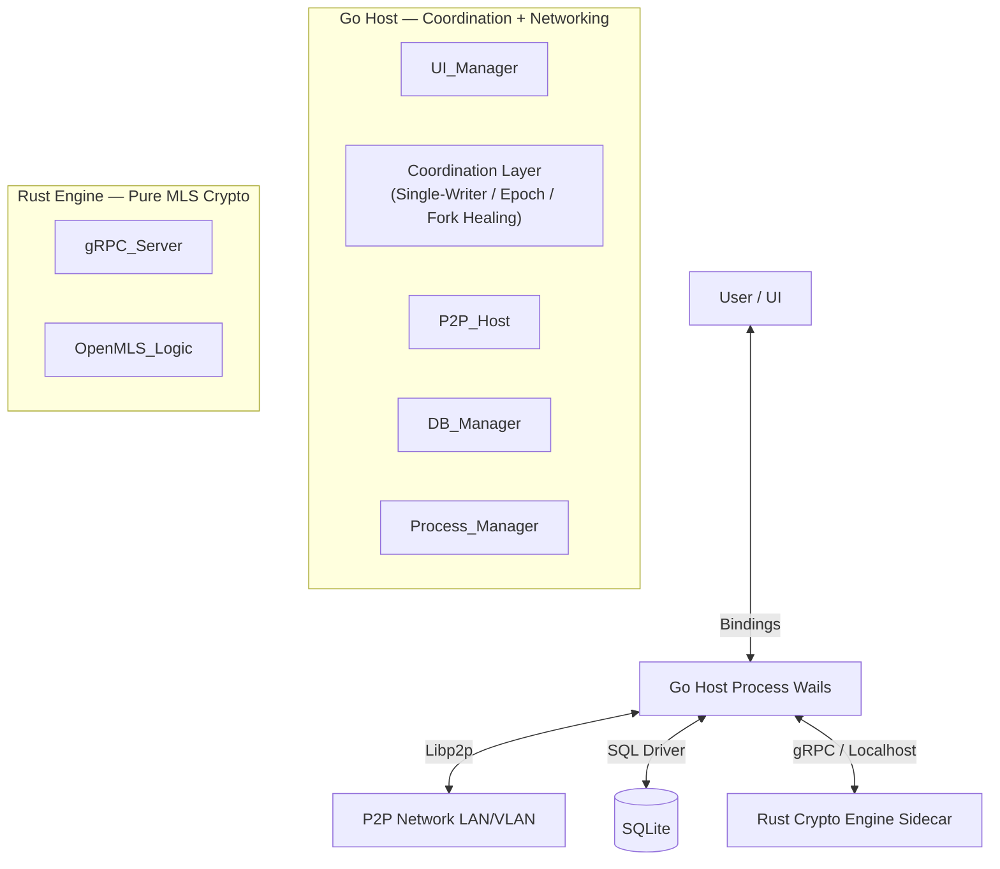

# DECENTRALIZED COORDINATION PROTOCOL FOR MLS ON PEER-TO-PEER NETWORKS (THESIS PROJECT)

> **CONTEXT FOR AI AGENTS:** This project is a **Graduation Thesis** with two objectives:
>
> 1. **Research (Core):** Design a **Decentralized Coordination Protocol** that wraps around the MLS standard (RFC 9420), enabling it to maintain causal consistency and total ordering on a chaotic P2P network without a central Delivery Service.
> 2. **Application:** Build a serverless, zero-trust internal communication platform for high-security organizations that implements the protocol above.
>
> **CORE ARCHITECTURE:** Sidecar Pattern. A **Go** host application (Networking + Coordination Layer) manages a headless **Rust** cryptographic engine (MLS operations) via gRPC over localhost.
>
> **IMPORTANT NOTE FOR AI AGENTS:** When implementing features, always refer to `PROJECT_PLAN.md` for the specific phase and task details. Prioritize **Correctness > Security > Consistency > Performance**.

## 1. SYSTEM ARCHITECTURE

The system follows a **Local-First, Sidecar Architecture** with a clear two-tier separation: the **Coordination Layer** (Go) handles routing, ordering, and consensus, while the **Crypto Layer** (Rust/OpenMLS) handles pure MLS operations.

### 1.1. High-Level Diagram


```mermaid
graph TD
    User[User / UI] <--> |Bindings| Go[Go Host Process Wails]
    Go <--> |Libp2p| Network[P2P Network LAN/VLAN]
    Go <--> |SQL Driver| DB[(SQLite)]
    Go <--> |gRPC / Localhost| Rust[Rust Crypto Engine Sidecar]

    subgraph Go_Host [Go Host — Coordination + Networking]
        UI_Manager
        Coordination_Layer["Coordination Layer<br/>(Single-Writer / Epoch / Fork Healing)"]
        P2P_Host
        DB_Manager
        Process_Manager
    end

    subgraph Rust_Engine [Rust Engine — Pure MLS Crypto]
        gRPC_Server
        OpenMLS_Logic
    end
```

### 1.2. Component Responsibilities

*   **Frontend (React/TS):** Renders UI, handles user input, communicates with Go via Wails Runtime.
*   **Backend (Go - Wails):**
    *   **Process Manager:** Spawns the Rust binary on a random ephemeral port and manages its lifecycle (Start/Stop).
    *   **Coordination Layer (CORE RESEARCH):** Implements the Decentralized Coordination Protocol:
        *   **Single-Writer Protocol:** Manages Epoch Token Holder election, Proposal routing, and Commit authority.
        *   **Epoch Consistency:** Validates epoch numbers on all incoming MLS operations; rejects stale/future operations.
        *   **Fork Healing:** Detects network partitions via Gossip Heartbeat, computes branch weight W, orchestrates External Join for losing branches.
        *   **ActiveView Management:** Tracks online peers, handles Token Holder failover on timeout.
    *   **Networking:** Manages Libp2p Host, DHT, GossipSub, and mDNS.
    *   **Persistence:** Manages SQLite database (User profiles, Group state, Chat history, Epoch metadata).
    *   **Orchestrator:** Acts as the bridge between UI, Network, Coordination Layer, and Crypto Engine.
*   **Crypto Engine (Rust - OpenMLS):**
    *   **Stateless Service:** Does not access the disk directly. Receives state from Go, processes it, and returns the result.
    *   **MLS Logic:** Handles Group creation, Proposal generation, Commit generation, Key rotation, Encryption/Decryption, External Join, MLS Exporter.
    *   **Interface:** Exposes a gRPC Service (Protobuf).

### 1.3. The Decentralized Coordination Protocol (Core Research Contribution)

**Problem:** MLS (RFC 9420) assumes a central Delivery Service to serialize state-changing operations. Without it, concurrent Commits cause DAG forking and protocol collapse.

**Solution:** A Decentralized Coordination Wrapper with four mechanisms:

#### Mechanism 1 — Single-Writer Protocol (Epoch Token Holder)

Instead of resolving conflicts after they occur, the system **eliminates concurrent commits entirely** by ensuring only one node — the **Epoch Token Holder** — has Commit authority at any given time.

*   **Implicit Election (no communication overhead):**
    ```
    TokenHolder = argmin_{node ∈ ActiveView} H(nodeID || epoch_number)
    ```
    Every node computes the same result deterministically. No voting round needed.

*   **Proposal/Commit Separation:** Any node may create and gossip a Proposal. Only the Token Holder collects Proposals and issues a single Commit to advance the group to epoch E+1.

*   **Token Rotation:** After epoch transitions to E+1, all nodes recompute `TokenHolder` for the new epoch.

*   **Failover:** If the Token Holder does not emit a Commit within `T_timeout` (3–5 seconds), nodes evict it from `ActiveView` and elect a new holder.

#### Mechanism 2 — Causal Consistency via Epoch Checks

Every MLS operation carries the sender's current `epoch_number`:

| Condition | Action |
|---|---|
| `msg.epoch == local.epoch` | Process normally |
| `msg.epoch < local.epoch` (stale) | Reject; send `CurrentEpochNotification` to sender |
| `msg.epoch > local.epoch` (future) | Buffer; request state sync from sender |

This guarantees no MLS operation is ever applied to an inconsistent Ratchet Tree state.

#### Mechanism 3 — Group Fork Healing (Network Partition Recovery)

When a physical network partition occurs, each partition evolves independently. On reconnection:

1.  **Detection:** Gossip Heartbeat — each node periodically broadcasts `GroupStateAnnouncement { W, TreeHash }`.
2.  **Branch Weight Function (multi-variable, ordered by priority):**
    ```
    W = (C_members, E, H_commit)
    ```
    *   `C_members` — online member count (protects majority experience)
    *   `E` — epoch count (more evolved branch)
    *   `H_commit` — last commit hash (deterministic tiebreaker)
3.  **Healing Process (losing branch):**
    *   Drop current `MlsGroup` from memory.
    *   Validate the winning branch's Committer signature via X.509 certificate in `GroupInfo`.
    *   Perform **External Join** into the winning branch.
    *   **Autonomous Replay:** Each node re-encrypts and resends its own messages only. Messages from other nodes are NOT cross-recovered (preserves Non-repudiation).
4.  **Security:** Forward Secrecy preserved absolutely (losing branch keys destroyed). PCS temporarily weakened but restored immediately after External Join completes.

#### Mechanism 4 — Hybrid Logical Clock (Message Display Ordering)

Epoch numbers order MLS state changes but NOT application messages within an epoch. Multiple users can send messages concurrently within the same epoch, and GossipSub does not guarantee delivery order. Without a dedicated ordering mechanism, each node may display messages in a different sequence.

**Solution:** Every application message carries a **Hybrid Logical Clock (HLC)** timestamp combining wall-clock time with a logical counter:

```
HLCTimestamp = (L, C, NodeID)
  L  = max(local_physical_time, received_L)   — wall-clock component (unix ms)
  C  = logical counter for events at same L
  NodeID = deterministic tiebreaker
```

*   **On send:** `L = max(local_L, physical_time)`. If `L` unchanged, `C++`; else `C = 0`.
*   **On receive** `(L_msg, C_msg)`: `L = max(local_L, L_msg, physical_time)`. Counter merges accordingly.
*   **Comparison:** `(L1,C1,ID1) < (L2,C2,ID2)` lexicographically.

**Properties:**
*   **Causal consistency:** If Alice reads Bob's message then replies, her reply is guaranteed to appear after Bob's message on every node.
*   **Total order:** All nodes sort messages identically, even for concurrent messages.
*   **NTP-independent:** Works correctly in air-gapped networks with clock skew — `L` only ever moves forward.
*   **Human-readable:** `L` is a Unix millisecond timestamp — the UI displays it as "10:00 AM".

**Clock architecture summary:**

| Clock | Purpose | Used by |
|---|---|---|
| **Epoch Number** (logical counter) | MLS state ordering, Token Holder election, Fork Healing | Single-Writer, Epoch Checks |
| **HLC** (hybrid logical) | Application message display ordering | Message send/receive |
| **Local wall clock** (`time.Now`) | Liveness detection, feeds into HLC | Heartbeat, T_timeout |

## 2. TECHNICAL STACK & CONSTRAINTS

### 2.1. Core Technologies

*   **App Framework:** Wails v2 (Go + Webview).
*   **Networking:** go-libp2p (TCP, QUIC, Noise, Yamux, GossipSub, Kademlia DHT).
*   **Cryptography:** `openmls` (Rust crate) served via `tonic` (gRPC).
*   **Database:** SQLite (embedded via Go).
*   **Protocol Buffers:** Used for IPC between Go and Rust.

### 2.2. Critical Implementation Rules (DO NOT VIOLATE)

*   **Sidecar Pattern:** The Rust binary MUST NOT be started manually. The Go app MUST spawn it using `os/exec` and pass the listening port via CLI flag (e.g., `--port 12345`).
*   **Stateless Rust:** The Rust engine MUST NOT store state (Ratchet Trees, Keys) permanently. Go retrieves state from SQLite → Sends to Rust → Rust computes → Returns new state → Go saves to SQLite.
*   **Strict Onboarding:** No node can join the Gossip network without a valid `InvitationToken` signed by the Root Admin Key.
*   **Single Active Device:** A user account is valid on only ONE device at a time. Login on a new device triggers a signed `KILL_SESSION` broadcast.
*   **Manual Identity Migration:** Private Keys are NEVER sent over the network (even encrypted). They must be exported to a file (`.backup`) encrypted with a Passphrase and manually transferred.
*   **Offline Handling:** Messages to offline peers must be stored in the DHT (Neighborhood Storage) encrypted.
*   **Single-Writer Invariant:** At any given epoch, only the deterministically elected Token Holder may issue a Commit. All other nodes MUST route their Proposals through Gossip and wait for the Token Holder's Commit.
*   **Epoch Monotonicity:** A node MUST NOT process any MLS Commit/Proposal with an epoch number lower than its current epoch.
*   **PKI Rules (CRITICAL):**
    *   MLS Private Key is generated ON the user's machine and NEVER leaves it (not even encrypted over the network).
    *   Root Admin Private Key MUST NOT be embedded in the client binary. It lives only in the Admin's encrypted local storage.
    *   `InvitationToken` MUST bind BOTH `PeerID` (network layer) AND `MLS PublicKey` (app layer). Binding only one enables spoofing attacks.
    *   Auth handshake MUST verify `token.PeerID == stream.Conn().RemotePeer()` to prevent Token Replay Attacks. The Noise Protocol proves PeerID ownership cryptographically.
    *   `bootstrap_addr` inside a bundle MUST include the `/p2p/PeerID` suffix — without it, Noise Protocol cannot authenticate the bootstrap node's identity.
    *   Admin assigns the user's `display_name` (via `--bundle-name`) when creating the bundle. Users do not name themselves.

## 3. DATA FLOW WORKFLOWS

### 3.0. Identity Onboarding (CSR Flow — First Launch)

This is a standard PKI Certificate Signing Request flow. The MLS Private Key is generated locally and never leaves the user's machine. **The display name is assigned by Admin** — users do not name themselves.

**Step A — New User (Alice) — First Launch:**
1.  `backend --setup` → `GetOrCreateLibp2pIdentity()` → `PeerID_Alice`.
2.  Rust `GenerateIdentity()` → `MLS_PrivKey` (saved locally) + `MLS_PubKey` (empty credential at this stage).
3.  App prints `PeerID_Alice` + `MLS_PubKey_hex` → Alice sends both to Admin out-of-band (Zalo, email, etc.).
4.  App enters `StateAwaitingBundle` — P2P networking does NOT start yet.

**Step B — Admin (creates bundle on their machine):**
1.  Admin receives `PeerID_Alice` + `MLS_PubKey_Alice` out-of-band.
2.  Admin decides the display name: `--bundle-name "Alice"`.
3.  Admin signs token: `{ DisplayName="Alice", PeerID_Alice, MLS_PubKey_Alice, IssuedAt, ExpiresAt }`.
4.  `bootstrap_addr` = `/ip4/AdminIP/tcp/AdminPort/p2p/AdminPeerID` (PeerID suffix is mandatory).
5.  Admin packages `InvitationBundle: { signed_token, bootstrap_addr, root_public_key }`.
6.  Admin sends `.local/invite.bundle` to Alice out-of-band.

**Step C — Alice imports bundle:**
1.  `backend --import-bundle alice.bundle`.
2.  App verifies 4 checks: (a) Admin signature valid, (b) `token.PeerID == myPeerID`, (c) `token.PublicKey == myMLSPubKey`, (d) token not expired.
3.  Bundle + Admin-assigned name `"Alice"` saved to SQLite → `StateAuthorized` → P2P starts → connects to `bootstrap_addr` → auth handshake with all peers.

### 3.1. Startup & IPC Connection

1.  **Go App Starts:** Finds a free TCP port (e.g., `54321`).
2.  **Spawn Sidecar:** Executes `./crypto-engine --port 54321`.
3.  **Connect:** Go gRPC Client connects to `127.0.0.1:54321`.
4.  **Ping:** Go calls `Ping()` to verify the engine is ready.

### 3.2. Sending a Group Message (via Coordination Layer)

1.  **UI:** User types "Hello".
2.  **Go (Coordination):** Fetches current `GroupState` + `epoch_number` from SQLite.
3.  **Go (HLC):** Generates HLC timestamp via `hlc.Now()`.
4.  **IPC:** Go calls Rust `EncryptMessage(GroupState, "Hello")`.
5.  **Rust:** Encrypts payload using current epoch's application secret → Returns (`MlsMessage`, `NewGroupState`).
6.  **Go:**
    *   Saves `NewGroupState` to SQLite.
    *   Wraps message in `Envelope { epoch, hlc_timestamp, MlsMessage }`.
    *   Broadcasts via GossipSub (Topic: `group_id`).

### 3.3. Receiving a Group Message (via Coordination Layer)

1.  **Go (Libp2p):** Receives `Envelope` bytes from GossipSub.
2.  **Go (Coordination — Epoch Check):**
    *   If `msg.epoch == local.epoch` → proceed to step 3.
    *   If `msg.epoch < local.epoch` → reject, send `CurrentEpochNotification`.
    *   If `msg.epoch > local.epoch` → buffer, request state sync.
3.  **Go (HLC):** Updates local HLC via `hlc.Update(msg.hlc_timestamp)`.
4.  **IPC:** Go calls Rust `ProcessMessage(GroupState, MlsCiphertext)`.
5.  **Rust:** Decrypts message, verifies signature → Returns (`DecryptedText`, `NewGroupState`).
6.  **Go:**
    *   Saves `NewGroupState`, `DecryptedText`, and `HLCTimestamp` to SQLite.
    *   Emits event to UI — messages displayed sorted by HLC timestamp.

### 3.4. MLS State Change (Proposal → Commit via Single-Writer)

1.  **Any node** creates a Proposal (e.g., Add/Remove/Update) → broadcasts via GossipSub.
2.  **All nodes** receive and buffer the Proposal locally.
3.  **Token Holder** (for current epoch E):
    *   Collects buffered Proposals.
    *   Calls Rust `CreateCommit(GroupState, Proposals[])`.
    *   Rust generates Commit + optional Welcome messages → Returns `NewGroupState` (epoch E+1).
    *   Token Holder broadcasts Commit via GossipSub.
4.  **All other nodes** receive Commit:
    *   Calls Rust `ProcessCommit(GroupState, CommitBytes)`.
    *   Advance to epoch E+1.
    *   Recompute `TokenHolder` for E+1.
5.  **Failover:** If Token Holder does not emit Commit within `T_timeout`:
    *   Nodes evict it from `ActiveView`.
    *   New `TokenHolder` computed → assumes Commit authority.

### 3.5. Group Fork Healing (Network Partition Recovery)

1.  **During partition:** Each sub-network evolves independently (different epoch chains).
2.  **On reconnection:** Gossip Heartbeat detects divergent `TreeHash` values.
3.  **Branch comparison:** Each node computes `W = (C_members, E, H_commit)`.
4.  **Losing branch nodes:**
    *   Drop current MlsGroup.
    *   Validate winning branch `GroupInfo` (Committer signature via X.509).
    *   Perform External Join into winning branch via Rust engine.
    *   Re-encrypt own messages (Autonomous Replay) and resend.
5.  **Result:** All nodes converge to a single epoch and TreeHash.

### 3.6. Secure Identity Export / Import (Device Migration)

**Export (old device):**
1.  User selects "Export Identity" → enters Passphrase.
2.  Go fetches `libp2p_private_key` + `mls_signing_key` + `mls_credential` + `invitation_token` from SQLite.
3.  Calls Rust `ExportIdentity(data, passphrase)` → AES-256-GCM encrypted blob (key derived via Argon2id).
4.  Go saves blob to `.backup` file.

**Import (new device):**
1.  User selects `.backup` file → enters Passphrase.
2.  Go reads file → Calls Rust `ImportIdentity(blob, passphrase)`.
3.  Rust decrypts → Returns `libp2p_private_key` + `mls_signing_key` + `mls_credential` + `invitation_token`.
4.  Go stores all keys in SQLite → **PeerID is restored** (same Libp2p key → same PeerID → passes auth handshake).
5.  Signs & broadcasts `KILL_SESSION` to invalidate old device → connects to P2P.

> **NOTE:** The `.backup` file MUST contain `libp2p_private_key`. Without it, the new device generates a new PeerID which does NOT match the `token.PeerID` in the InvitationToken → auth handshake fails.

**Admin migration:** Only requires copying `admin.db` to the new machine. The Root Admin Key is already encrypted with the passphrase inside that file — no special export tool needed.

### 3.7. Secure Direct Swarming (File Transfer)

1.  **Sender:** Uses **MLS Exporter** to derive a one-time symmetric key from current group secrets.
2.  **Sender:** Encrypts file with derived key → splits into chunks → announces metadata via GossipSub.
3.  **Receivers:** Download chunks from sender (and other receivers who already have chunks) in parallel — similar to BitTorrent swarming.
4.  **Receivers:** Reassemble + decrypt using the same MLS Exporter-derived key.

## 4. DIRECTORY STRUCTURE

```
/
├── app/                        # Go + Wails App (module: "app")
│   ├── main.go                 # Entry point: branches CLI vs GUI (--headless / IsCommand)
│   ├── app.go                  # Wails App struct + all bindings + runWailsApp()
│   ├── runner.go               # run() — CLI orchestration, dispatches to commands or node
│   ├── cli.go                  # Config struct + parseCLI() + IsCommand()
│   ├── commands.go             # Command handlers: cmdAdminSetup, cmdCreateBundle, cmdSetup, cmdImportBundle
│   ├── node.go                 # startNode, runP2PNode, connectBootstrap, pingLoop, waitForShutdown
│   ├── crypto_engine.go        # startCryptoEngine (Rust sidecar lifecycle + gRPC)
│   ├── log.go                  # setupLogging, LogFilterHandler (suppress mDNS noise)
│   ├── app_state.go            # AppState enum: Uninitialized/AwaitingBundle/Authorized/AdminReady
│   ├── process.go              # Rust sidecar OS process management
│   ├── wails.json              # Wails config (frontend:dir = "frontend")
│   ├── .local/                 # Runtime-generated files (gitignored, auto-created on first run)
│   │   ├── app.db              # SQLite database (default path)
│   │   └── invite.bundle       # Generated InvitationBundle (default output path)
│   ├── admin/                  # Admin PKI package
│   │   ├── token.go            # InvitationToken, InvitationBundle structs + Sign/Verify/Serialize
│   │   └── admin.go            # SetupAdminKey, UnlockAdminKey, CreateInvitationBundle
│   ├── p2p/                    # Libp2p logic
│   │   ├── host.go             # Libp2p Host, DHT, GossipSub, mDNS, ConnectionGater integration
│   │   ├── identity.go         # Libp2p PeerID persistence (GetOrCreateIdentity)
│   │   ├── pubsub.go           # GossipSub ChatRoom
│   │   ├── auth.go             # OnboardNewUser, ImportInvitationBundle, GetOnboardingInfo, BuildLocalToken
│   │   ├── gater.go            # AuthGater (blacklist-based) implementing network.ConnectionGater
│   │   └── auth_protocol.go    # /app/auth/1.0.0 — length-prefixed token handshake + authNetworkNotifee
│   ├── coordination/           # Decentralized Coordination Protocol (CORE RESEARCH — Phase 4)
│   │   ├── interfaces.go       # Contracts: Transport, Clock, MLSEngine, CoordinationStorage
│   │   ├── types.go            # Data types, wire messages, enums, sentinel errors
│   │   ├── config.go           # CoordinatorConfig with all tuneable parameters
│   │   ├── hlc.go              # Hybrid Logical Clock — message display ordering
│   │   ├── metrics.go          # Thread-safe instrumentation for evaluation
│   │   ├── epoch.go            # Epoch tracking, epoch validation, CurrentEpochNotification
│   │   ├── single_writer.go    # Token Holder election, Proposal routing, Commit authority
│   │   ├── active_view.go      # ActiveView management, heartbeat, peer liveness
│   │   └── fork_healing.go     # Partition detection, branch weight W, External Join orchestration
│   ├── db/                     # SQLite logic
│   │   └── db.go               # Tables: system_config, mls_identity, auth_bundle, mls_groups, messages
│   ├── mls_service/            # Auto-generated gRPC bindings (do not edit)
│   └── frontend/               # React + TypeScript + Tailwind (Vite)
│       ├── src/
│       │   ├── App.tsx                      # Root: polls GetAppState, state-based routing
│       │   ├── screens/
│       │   │   ├── SetupScreen.tsx          # State: UNINITIALIZED
│       │   │   ├── AwaitingBundleScreen.tsx # State: AWAITING_BUNDLE (+ Admin Quick Setup)
│       │   │   └── DashboardScreen.tsx      # State: AUTHORIZED / ADMIN_READY
│       │   └── components/
│       │       ├── AdminPanel.tsx           # Init admin key + Create bundle tabs
│       │       ├── CopyField.tsx            # Copy-to-clipboard field
│       │       ├── StatusBadge.tsx          # Colored state pill
│       │       └── PeerList.tsx             # Connected peers table
│       └── wailsjs/                         # Auto-generated Wails bindings (do not edit)
│           └── go/main/App.d.ts             # TypeScript types for all App methods
│
├── crypto-engine/              # Rust Code (Stateless gRPC Sidecar)
│   ├── src/
│   │   ├── main.rs             # CLI arg parsing & gRPC Server setup (tonic)
│   │   └── mls.rs              # OpenMLS logic: generate_identity, group ops, export/import
│   └── Cargo.toml
│
├── proto/                      # Shared Protocol Buffers
│   └── mls_service.proto
│
├── PROJECT_PLAN.md             # Detailed execution roadmap (phases + tasks)
├── CURRENT_STATE.md            # AI Agent short-term memory (current progress + key decisions)
└── README.md                   # This file
```

## 5. DEVELOPER COMMANDS

### 5.1. Generate Protobufs (Go bindings)

Run from the project root:

```bash
protoc --go_out=. --go-grpc_out=. --proto_path=./proto mls_service.proto
```

### 5.2. Running in Development

The Go backend auto-spawns the Rust sidecar — build it first.

**Step 1: Build Rust Engine**

```bash
cd crypto-engine
cargo build
```

**Step 2a: GUI mode** (Wails dev server with hot-reload)

```bash
cd app
wails dev
```

**Step 2b: Headless / CLI mode**

```bash
cd app
go run . --headless
```

### 5.3. Generate Wails TypeScript Bindings

Run after adding or modifying any exported method on the `App` struct in `app/app.go`:

```bash
cd app
wails generate module
```

Output: `app/frontend/wailsjs/go/main/App.d.ts` + `App.js`

### 5.4. Build Production

```bash
# 1. Build Rust binary (release mode)
cd crypto-engine && cargo build --release

# 2. Build Go/Wails app (requires Wails CLI)
cd ../app && wails build
```

### 5.5. CLI Flags & Onboarding Commands

All commands are run from the `app/` directory. The `.local/` folder is created automatically on first run.

**Full onboarding sequence (first-time setup) — CLI mode:**

```powershell
# Step 1 — User: generate MLS key pair (run once)
go run . --setup
# → prints PeerID and MLS PublicKey hex → send both to Admin out-of-band

# Step 2 — Admin: initialise Root Admin key (run once on admin machine)
go run . --db .local/admin.db --admin-setup --admin-passphrase "StrongPassphrase"

# Step 3 — Admin: create InvitationBundle for a new user
go run . --db .local/admin.db --create-bundle `
  --bundle-name    "Alice" `
  --bundle-peer-id "12D3KooW..." `
  --bundle-pub-key "a3f7c2..." `
  --admin-passphrase "StrongPassphrase" `
  --bundle-output  .local/alice.bundle
# → send .local/alice.bundle to Alice out-of-band

# Step 4 — User: import bundle received from Admin
go run . --import-bundle .local/alice.bundle

# Step 5 — Normal operation (headless)
go run . --headless
```

**Admin Quick Setup — GUI mode:**
If the admin key has already been initialized (`--admin-setup`), opening the GUI while in `AWAITING_BUNDLE` state shows an "Admin Quick Setup" card — enter display name + passphrase to create and import a self-bundle in one click.

**Testing multiple nodes on one machine:**

```powershell
# Node 1 (Admin / bootstrap node)
go run . --headless --db .local/node1.db --p2p-port 4001 --write-bootstrap .local/bootstrap.txt

# Node 2 (after importing a bundle for its PeerID)
go run . --headless --db .local/node2.db --p2p-port 4002
```

**All available flags:**

| Flag | Default | Description |
|------|---------|-------------|
| `--db` | `.local/app.db` | Path to SQLite database file |
| `--p2p-port` | `4001` | Port for Libp2p TCP connections |
| `--bootstrap` | *(from bundle)* | Override bootstrap multiaddr (for testing) |
| `--write-bootstrap` | — | Write own multiaddr to a file after startup |
| `--headless` | `false` | Run without GUI |
| `--setup` | — | Generate MLS key pair (first-time, run once) |
| `--import-bundle` | — | Path to `.bundle` file received from Admin |
| `--admin-setup` | — | Generate Root Admin key pair (admin machine only) |
| `--admin-passphrase` | — | Passphrase to encrypt / unlock the Root Admin key |
| `--create-bundle` | — | Create an InvitationBundle for a new user (Admin only) |
| `--bundle-name` | — | Display name for the new user |
| `--bundle-peer-id` | — | Libp2p PeerID of the new user |
| `--bundle-pub-key` | — | Hex-encoded MLS public key of the new user |
| `--bundle-output` | `.local/invite.bundle` | Output path for the generated `.bundle` file |
