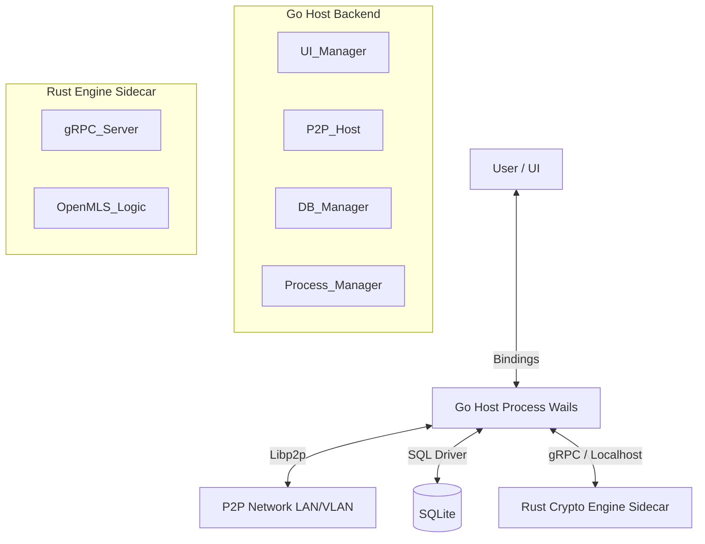

# SECURE PRIVATE P2P COMMUNICATION SYSTEM (THESIS PROJECT)

> **CONTEXT FOR AI AGENTS:** This project is a **Graduation Thesis** focused on building a serverless, zero-trust internal communication platform for high-security organizations. It utilizes **Pure P2P** architecture combined with the **MLS (Messaging Layer Security)** protocol.
>
> **CORE ARCHITECTURE:** Sidecar Pattern. A **Go** host application manages a headless **Rust** cryptographic engine via gRPC over localhost.
>
> **IMPORTANT NOTE FOR AI AGENTS:** When implementing features, always refer to `PROJECT_PLAN.md` for the specific phase and task details. Prioritize Security and Consistency over Performance.

## 1. SYSTEM ARCHITECTURE

The system follows a **Local-First, Sidecar Architecture** where the UI and Networking logic are decoupled from the Cryptographic Engine.

### 1.1. High-Level Diagram


```mermaid
graph TD
    User[User / UI] <--> |Bindings| Go[Go Host Process Wails]
    Go <--> |Libp2p| Network[P2P Network LAN/VLAN]
    Go <--> |SQL Driver| DB[(SQLite)]
    Go <--> |gRPC / Localhost| Rust[Rust Crypto Engine Sidecar]

    subgraph Go_Host [Go Host Backend]
        UI_Manager
        P2P_Host
        DB_Manager
        Process_Manager
    end

    subgraph Rust_Engine [Rust Engine Sidecar]
        gRPC_Server
        OpenMLS_Logic
    end
```

### 1.2. Component Responsibilities

*   **Frontend (React/TS):** Renders UI, handles user input, communicates with Go via Wails Runtime.
*   **Backend (Go - Wails):**
    *   **Process Manager:** Spawns the Rust binary on a random ephemeral port and manages its lifecycle (Start/Stop).
    *   **Networking:** Manages Libp2p Host, DHT, GossipSub, and mDNS.
    *   **Persistence:** Manages SQLite database (User profiles, Chat history, KV Store).
    *   **Orchestrator:** Acts as the bridge between UI, Network, and Crypto Engine.
*   **Crypto Engine (Rust - OpenMLS):**
    *   **Stateless Service:** Does not access the disk directly. Receives state from Go, processes it, and returns the result.
    *   **MLS Logic:** Handles Group creation, Commit generation, Key rotation, Encryption/Decryption.
    *   **Interface:** Exposes a gRPC Service (Protobuf).

## 2. TECHNICAL STACK & CONSTRAINTS

### 2.1. Core Technologies

*   **App Framework:** Wails v2 (Go + Webview).
*   **Networking:** go-libp2p (TCP, QUIC, Noise, Yamux, GossipSub, Kademlia DHT).
*   **Cryptography:** `openmls` (Rust crate) served via `tonic` (gRPC).
*   **Database:** SQLite (embedded via Go).
*   **Protocol Buffers:** Used for IPC between Go and Rust.

### 2.2. Critical Implementation Rules (DO NOT VIOLATE)

*   **Sidecar Pattern:** The Rust binary MUST NOT be started manually. The Go app MUST spawn it using `os/exec` and pass the listening port via CLI flag (e.g., `--port 12345`).
*   **Stateless Rust:** The Rust engine MUST NOT store state (Ratchet Trees, Keys) permanently. Go retrieves state from SQLite → Sends to Rust → Rust computes → Returns new state → Go saves to SQLite.
*   **Strict Onboarding:** No node can join the Gossip network without a valid `InvitationToken` signed by the Root Admin Key.
*   **Single Active Device:** A user account is valid on only ONE device at a time. Login on a new device triggers a signed `KILL_SESSION` broadcast.
*   **Manual Identity Migration:** Private Keys are NEVER sent over the network (even encrypted). They must be exported to a file (`.backup`) encrypted with a Passphrase and manually transferred.
*   **Offline Handling:** Messages to offline peers must be stored in the DHT (Neighborhood Storage) encrypted.
*   **PKI Rules (CRITICAL):**
    *   MLS Private Key is generated ON the user's machine and NEVER leaves it (not even encrypted over the network).
    *   Root Admin Private Key MUST NOT be embedded in the client binary. It lives only in the Admin's encrypted local storage.
    *   `InvitationToken` MUST bind BOTH `PeerID` (network layer) AND `MLS PublicKey` (app layer). Binding only one enables spoofing attacks.
    *   Auth handshake MUST verify `token.PeerID == stream.Conn().RemotePeer()` to prevent Token Replay Attacks. The Noise Protocol proves PeerID ownership cryptographically.
    *   `bootstrap_addr` inside a bundle MUST include the `/p2p/PeerID` suffix — without it, Noise Protocol cannot authenticate the bootstrap node's identity.
    *   Admin assigns the user's `display_name` (via `--bundle-name`) when creating the bundle. Users do not name themselves.

## 3. DATA FLOW WORKFLOWS

### 3.0. Identity Onboarding (CSR Flow — First Launch)

This is a standard PKI Certificate Signing Request flow. The MLS Private Key is generated locally and never leaves the user's machine. **The display name is assigned by Admin** — users do not name themselves.

**Step A — New User (Alice) — First Launch:**
1.  `backend --setup` → `GetOrCreateLibp2pIdentity()` → `PeerID_Alice`.
2.  Rust `GenerateIdentity()` → `MLS_PrivKey` (saved locally) + `MLS_PubKey` (empty credential at this stage).
3.  App prints `PeerID_Alice` + `MLS_PubKey_hex` → Alice sends both to Admin out-of-band (Zalo, email, etc.).
4.  App enters `StateAwaitingBundle` — P2P networking does NOT start yet.

**Step B — Admin (creates bundle on their machine):**
1.  Admin receives `PeerID_Alice` + `MLS_PubKey_Alice` out-of-band.
2.  Admin decides the display name: `--bundle-name "Alice"`.
3.  Admin signs token: `{ DisplayName="Alice", PeerID_Alice, MLS_PubKey_Alice, IssuedAt, ExpiresAt }`.
4.  `bootstrap_addr` = `/ip4/AdminIP/tcp/AdminPort/p2p/AdminPeerID` (PeerID suffix is mandatory).
5.  Admin packages `InvitationBundle: { signed_token, bootstrap_addr, root_public_key }`.
6.  Admin sends `.local/invite.bundle` to Alice out-of-band.

**Step C — Alice imports bundle:**
1.  `backend --import-bundle alice.bundle`.
2.  App verifies 4 checks: (a) Admin signature valid, (b) `token.PeerID == myPeerID`, (c) `token.PublicKey == myMLSPubKey`, (d) token not expired.
3.  Bundle + Admin-assigned name `"Alice"` saved to SQLite → `StateAuthorized` → P2P starts → connects to `bootstrap_addr` → auth handshake with all peers.

### 3.1. Startup & IPC Connection

1.  **Go App Starts:** Finds a free TCP port (e.g., `54321`).
2.  **Spawn Sidecar:** Executes `./crypto-engine --port 54321`.
3.  **Connect:** Go gRPC Client connects to `127.0.0.1:54321`.
4.  **Ping:** Go calls `Ping()` to verify the engine is ready.

### 3.2. Sending a Group Message (MLS)

1.  **UI:** User types "Hello".
2.  **Go:** Fetches current `GroupState` from SQLite.
3.  **IPC:** Go calls Rust `EncryptMessage(GroupState, "Hello")`.
4.  **Rust:** Updates Ratchet Tree (if needed), encrypts payload → Returns (`MlsMessage`, `NewGroupState`).
5.  **Go:**
    *   Saves `NewGroupState` to SQLite.
    *   Broadcasts `MlsMessage` via Libp2p GossipSub (Topic: `group_id`).

### 3.3. Receiving a Group Message

1.  **Go (Libp2p):** Receives bytes from GossipSub.
2.  **Go:** Fetches current `GroupState`.
3.  **IPC:** Go calls Rust `ProcessMessage(GroupState, Bytes)`.
4.  **Rust:** Decrypts message, verifies signature, updates tree → Returns (`DecryptedText`, `NewGroupState`).
5.  **Go:**
    *   Saves `NewGroupState` and `DecryptedText` to SQLite.
    *   Emits event to UI to display message.

### 3.4. Secure Identity Export / Import (Device Migration)

**Export (old device):**
1.  User selects "Export Identity" → enters Passphrase.
2.  Go fetches `libp2p_private_key` + `mls_signing_key` + `mls_credential` + `invitation_token` from SQLite.
3.  Calls Rust `ExportIdentity(data, passphrase)` → AES-256-GCM encrypted blob (key derived via Argon2id).
4.  Go saves blob to `.backup` file.

**Import (new device):**
1.  User selects `.backup` file → enters Passphrase.
2.  Go reads file → Calls Rust `ImportIdentity(blob, passphrase)`.
3.  Rust decrypts → Returns `libp2p_private_key` + `mls_signing_key` + `mls_credential` + `invitation_token`.
4.  Go stores all keys in SQLite → **PeerID is restored** (same Libp2p key → same PeerID → passes auth handshake).
5.  Signs & broadcasts `KILL_SESSION` to invalidate old device → connects to P2P.

> **NOTE:** The `.backup` file MUST contain `libp2p_private_key`. Without it, the new device generates a new PeerID which does NOT match the `token.PeerID` in the InvitationToken → auth handshake fails.

**Admin migration:** Only requires copying `admin.db` to the new machine. The Root Admin Key is already encrypted with the passphrase inside that file — no special export tool needed.

## 4. DIRECTORY STRUCTURE

```
/
├── backend/                    # Go Code (Wails App)
│   ├── main.go                 # Thin entry point (~11 lines): parseCLI → setupLogging → run
│   ├── runner.go               # run() — orchestration, creates .local/, dispatches to commands or node
│   ├── cli.go                  # Config struct + parseCLI() — all CLI flag definitions
│   ├── commands.go             # Command handlers: cmdAdminSetup, cmdCreateBundle, cmdSetup, cmdImportBundle
│   ├── node.go                 # startNode, runP2PNode, connectBootstrap, pingLoop, waitForShutdown
│   ├── crypto_engine.go        # startCryptoEngine (Rust sidecar lifecycle + gRPC)
│   ├── log.go                  # setupLogging, LogFilterHandler (suppress mDNS noise)
│   ├── app_state.go            # AppState enum: Uninitialized/AwaitingBundle/Authorized/AdminReady
│   ├── process.go              # Rust sidecar OS process management (StdoutPipe, StderrPipe, Start)
│   ├── .local/                 # Runtime-generated files (gitignored, auto-created on first run)
│   │   ├── app.db              # SQLite database (default path)
│   │   └── invite.bundle       # Generated InvitationBundle (default output path)
│   ├── admin/                  # Admin PKI package
│   │   ├── token.go            # InvitationToken, InvitationBundle structs + Sign/Verify/Serialize
│   │   └── admin.go            # SetupAdminKey, UnlockAdminKey, CreateInvitationBundle
│   ├── p2p/                    # Libp2p logic
│   │   ├── host.go             # Libp2p Host, DHT, GossipSub, mDNS, ConnectionGater integration
│   │   ├── identity.go         # Libp2p PeerID persistence (GetOrCreateIdentity)
│   │   ├── pubsub.go           # GossipSub ChatRoom
│   │   ├── auth.go             # OnboardNewUser, ImportInvitationBundle, GetOnboardingInfo, BuildLocalToken
│   │   ├── gater.go            # AuthGater (blacklist-based) implementing network.ConnectionGater
│   │   └── auth_protocol.go    # /app/auth/1.0.0 — length-prefixed token handshake + authNetworkNotifee
│   ├── db/                     # SQLite logic
│   │   └── db.go               # Tables: system_config, mls_identity, auth_bundle, messages
│   └── mls_service/            # Auto-generated gRPC bindings (do not edit)
│
├── crypto-engine/              # Rust Code (Stateless gRPC Sidecar)
│   ├── src/
│   │   ├── main.rs             # CLI arg parsing & gRPC Server setup (tonic)
│   │   └── mls.rs              # OpenMLS logic: generate_identity (empty credential), export/import
│   └── Cargo.toml
│
├── frontend/                   # React Code (not yet implemented)
│   └── src/
│       ├── components/         # Chat UI, Login UI, Admin Panel UI
│       └── wailsjs/            # Auto-generated Wails bindings
│
├── proto/                      # Shared Protocol Buffers
│   └── mls_service.proto
│
├── PROJECT_PLAN.md             # Detailed execution roadmap (phases + tasks)
├── CURRENT_STATE.md            # AI Agent short-term memory (current progress + key decisions)
└── README.md                   # This file
```

## 5. DEVELOPER COMMANDS

### 5.1. Generate Protobufs (Go bindings)

Run from the project root:

```bash
protoc --go_out=. --go-grpc_out=. --proto_path=./proto mls_service.proto
```

### 5.2. Running in Development

The Go backend auto-spawns the Rust sidecar — build it first.

**Step 1: Build Rust Engine**

```bash
cd crypto-engine
cargo build
```

**Step 2: Run Go Backend** (always from the `backend/` directory so `.local/` lands in the right place)

```bash
cd backend
go run .
```

### 5.3. Build Production

```bash
# 1. Build Rust binary (release mode)
cd crypto-engine && cargo build --release

# 2. Build Go/Wails app (requires Wails CLI)
cd .. && wails build
```

### 5.4. CLI Flags & Onboarding Commands

All commands are run from the `backend/` directory. The `.local/` folder is created automatically on first run.

**Full onboarding sequence (first-time setup):**

```powershell
# Step 1 — User: generate MLS key pair (run once)
go run . --setup
# → prints PeerID and MLS PublicKey hex → send both to Admin out-of-band

# Step 2 — Admin: initialise Root Admin key (run once on admin machine)
go run . --db .local/admin.db --admin-setup --admin-passphrase "StrongPassphrase"

# Step 3 — Admin: create InvitationBundle for a new user
go run . --db .local/admin.db --create-bundle `
  --bundle-name    "Alice" `
  --bundle-peer-id "12D3KooW..." `
  --bundle-pub-key "a3f7c2..." `
  --admin-passphrase "StrongPassphrase" `
  --bundle-output  .local/alice.bundle
# → send .local/alice.bundle to Alice out-of-band

# Step 4 — User: import bundle received from Admin
go run . --import-bundle .local/alice.bundle

# Step 5 — Normal operation (StateAuthorized or StateAdminReady)
go run .
```

**Testing multiple nodes on one machine:**

```powershell
# Node 1 (Admin / bootstrap node)
go run . --db .local/node1.db --p2p-port 4001 --write-bootstrap .local/bootstrap.txt

# Node 2 (after importing a bundle for its PeerID)
go run . --db .local/node2.db --p2p-port 4002
```

**All available flags:**

| Flag | Default | Description |
|------|---------|-------------|
| `--db` | `.local/app.db` | Path to SQLite database file |
| `--p2p-port` | `4001` | Port for Libp2p TCP connections |
| `--bootstrap` | *(from bundle)* | Override bootstrap multiaddr (for testing) |
| `--write-bootstrap` | — | Write own multiaddr to a file after startup |
| `--headless` | `false` | Run without GUI |
| `--setup` | — | Generate MLS key pair (first-time, run once) |
| `--import-bundle` | — | Path to `.bundle` file received from Admin |
| `--admin-setup` | — | Generate Root Admin key pair (admin machine only) |
| `--admin-passphrase` | — | Passphrase to encrypt / unlock the Root Admin key |
| `--create-bundle` | — | Create an InvitationBundle for a new user (Admin only) |
| `--bundle-name` | — | Display name for the new user |
| `--bundle-peer-id` | — | Libp2p PeerID of the new user |
| `--bundle-pub-key` | — | Hex-encoded MLS public key of the new user |
| `--bundle-output` | `.local/invite.bundle` | Output path for the generated `.bundle` file |
