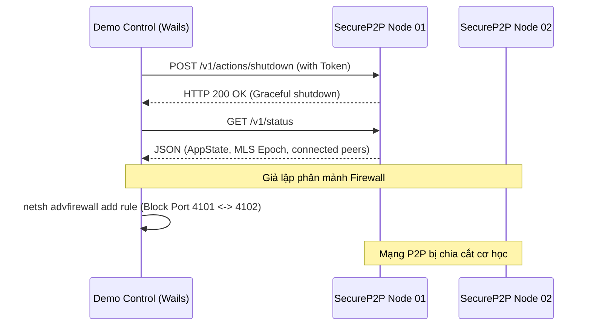

# 🎛️ DATN Demo Control Center (Hệ Thống Điều Khiển & Giám Sát Mô Phỏng P2P)

**DATN Demo Control** là ứng dụng desktop giám sát và điều khiển trung tâm được phát triển bằng **Wails v2** (Go backend & React + TypeScript frontend). Ứng dụng này đóng vai trò là "bệ phóng thử nghiệm" (testbed) và môi trường mô phỏng trực quan phục vụ cho Đồ Án Tốt Nghiệp (DATN) về **Giao thức đồng thuận phi tập trung (Decentralized Coordination Protocol) tích hợp MLS (Messaging Layer Security - RFC 9420) trên mạng P2P**.

Ứng dụng cho phép cấu hình, khởi chạy, tiêm lỗi (fault injection), tạo phân mảnh mạng nâng cao bằng Firewall thực tế, và theo dõi trực quan trạng thái đồng thuận của tối đa 10 node mạng SecureP2P chạy song song độc lập.

---

## 🚀 Tính Năng Cốt Lõi

### 1. Quản Lý Vòng Đời Node (Node Lifecycle Management)
* **Khởi chạy / Dừng / Khởi động lại**: Hỗ trợ quản lý độc lập từng node hoặc toàn bộ 10 node đồng thời (`Start All`, `Stop All`).
* **Hỗ trợ Chế độ Chạy**: Có khả năng chạy trực tiếp file thực thi được biên dịch sẵn (`SecureP2P.exe`) hoặc biên dịch nóng qua `go run .` tùy cấu hình.
* **Xóa dữ liệu (Reset DB)**: Cho phép làm sạch cơ sở dữ liệu SQLite của từng node hoặc tất cả các node về trạng thái ban đầu để thực hiện lại các lượt test mới.
* **Truy cập nhanh**: Phím tắt mở thư mục chạy runtime (`.demo-control/runtimes/node-XX`) hoặc thư mục chứa file DB của từng node để tiện debug.

### 2. Mô Phỏng Phân Mảnh Mạng Nâng Cao (Network Partition Injection)
* **Tự động hóa Windows Firewall (`netsh`)**: Thực hiện chặn kết nối hai chiều ở mức độ mạng thực tế giữa các node được chỉ định (cả TCP & UDP trên các cổng P2P).
* **Chia cụm linh hoạt (Partition Editor)**: Chọn các node cụ thể để chia mạng thành hai cụm độc lập (Cluster A và Cluster B) nhằm kiểm tra khả năng phục hồi khi xảy ra hiện tượng **Split-Brain**.
* **Cô lập node (Isolate Node)**: Cắt đứt hoàn toàn kết nối P2P của một node với tất cả các node còn lại để thử nghiệm lưu trữ và đồng bộ hóa tin nhắn offline.
* **Khôi phục mạng (Heal Firewall)**: Một nút bấm để dọn sạch toàn bộ các rule firewall được sinh ra bởi bộ điều khiển, đưa mạng P2P trở về trạng thái kết nối bình thường.

> [!WARNING]
> Do tính năng phân mảnh mạng can thiệp trực tiếp vào Windows Firewall thông qua công cụ `netsh`, **ứng dụng Demo Control cần được chạy dưới quyền Quản trị viên (Run as Administrator)** để các lệnh cấu hình Firewall hoạt động chính xác.

### 3. Giám Sát Trạng Thái Giao Thức Thời Gian Thực (Real-time Visualizer)
Hệ thống tự động thăm dò (poll) định kỳ trạng thái của các node thông qua cổng Control API cục bộ của từng node, cập nhật trực quan lên Dashboard:
* **Thông tin Node**: Trạng thái App (active/offline), Tiến trình khởi động (Startup Stage), Độ sẵn sàng của P2P và Cryptography (MLS), Địa chỉ Peer ID thực tế và số lượng peer đã kết nối.
* **Thông tin Nhóm MLS (Groups)**: Mã nhóm, Số Epoch hiện tại, Node đang giữ Token (Token Holder) kèm Peer ID tương ứng, Số thành viên đang hoạt động, Mã băm cây MLS rút gọn (Tree Hash Short) và trạng thái đang tự chữa lành (Is Healing).

### 4. Kịch Bản Thử Nghiệm Tự Động (Automated Scenarios)
Tích hợp sẵn các kịch bản test tích hợp tự động đa bước (Multi-step scenarios) để trình diễn các đặc tính ưu việt của giao thức:
1. **Normal Cluster Bring-Up**: Khởi chạy toàn bộ cụm node và đợi cho tới khi mạng P2P đạt trạng thái sẵn sàng.
2. **Offline Messaging Recovery Prep**: Cô lập một node nhất định (ví dụ `node-03`), đợi các node còn lại trao đổi thông tin, sau đó khôi phục kết nối và kích hoạt đồng bộ hóa offline (`Trigger Offline Sync`) để kiểm chứng khả năng nhận lại tin nhắn bị bỏ lỡ thông qua cơ chế Blind Store và Envelope Retention.
3. **Fork Healing Partition**: Chia đôi mạng thành 2 cụm độc lập (`1-3` và `4-6`), để hai bên tự do phát triển lệch Epoch (phân mảnh nhánh MLS), sau đó gỡ bỏ rào cản firewall để kích hoạt cơ chế **Tự phục hồi phân mảnh (Fork Healing)** thông qua Autonomous Replay và tái đồng thuận.
4. **Reset To Known Good State**: Dừng tất cả, xóa các luật Firewall, xóa sạch DB của tất cả các node và tái khởi động hệ thống về trạng thái ban đầu.

---

## 📁 Cấu Trúc Thư Mục `demo-control`

```
demo-control/
├── main.go               # Điểm khởi đầu của ứng dụng Wails, khởi tạo cửa sổ và cấu hình binding
├── app.go                # Logic xử lý backend chính: quản lý tiến trình node, gọi Control API, điều phối kịch bản
├── firewall.go           # Module quản lý tích hợp Windows Firewall (netsh) để chặn/mở kết nối P2P
├── types.go              # Định nghĩa cấu trúc dữ liệu trao đổi giữa Go và React Frontend (DTOs)
├── wails.json            # File cấu hình build/dev của Wails v2
├── go.mod / go.sum       # Khai báo các thư viện Go phụ thuộc (wails, echo, etc.)
└── frontend/             # Mã nguồn giao diện React + TypeScript
    ├── src/
    │   ├── App.tsx       # Giao diện chính thiết kế dạng Dashboard (Instances, Topology, Scenarios)
    │   ├── main.tsx      # Điểm render ứng dụng React
    │   ├── runtimeClient.ts # Client đóng gói các phương thức RPC gọi xuống Go backend
    │   ├── styles.css    # CSS tùy biến giao diện với tông màu tối tối tân (dark-mode), hiệu ứng glassmorphism
    │   └── types.ts      # Khai báo kiểu TypeScript ánh xạ từ Go structs
    └── vite.config.ts    # Cấu hình đóng gói frontend bằng Vite
```

---

## ⚙️ Cơ Chế Hoạt Động & Kết Nối

### 1. Cấu hình Workspace (`.demo-control/workspace.json`)
Khi chạy lần đầu tiên, ứng dụng tự động tìm thư mục gốc của repository DATN và tạo ra thư mục làm việc ẩn `.demo-control` nằm ở thư mục gốc của project. Thư mục này chứa:
* **`workspace.json`**: Định nghĩa danh sách 10 node mô phỏng. Mỗi node được phân bổ các tài nguyên cục bộ riêng biệt:
  * **Runtime Directory**: `.demo-control/runtimes/node-XX`
  * **SQLite Database Path**: `.demo-control/runtimes/node-XX/app.db`
  * **P2P Port**: `4100 + XX` (Ví dụ `node-01` dùng cổng `4101`)
  * **Control Port**: `5100 + XX` (Ví dụ `node-01` dùng cổng `5101`)
* **`runtimes/`**: Chứa dữ liệu hoạt động thực tế (Database, log files, khóa bảo mật) của từng node riêng biệt.

### 2. Giao tiếp giữa Demo Control và các Node
Việc điều khiển và lấy trạng thái được thực hiện thông qua **Control API** được nhúng sẵn trong mỗi node SecureP2P dưới dạng server HTTP siêu nhẹ, xác thực bằng mã Token bí mật (`X-Demo-Token`) được cấu hình động lúc khởi động.



---

## 🛠️ Hướng Dẫn Cài Đặt & Khởi Chạy

### Yêu Cầu Hệ Thống
1. **Hệ điều hành**: Windows (để sử dụng đầy đủ các tính năng chặn Firewall).
2. **Go**: Phiên bản >= 1.22
3. **Node.js & npm**: Phiên bản LTS mới nhất
4. **Wails CLI**: Đã cài đặt trên máy (`go install github.com/wailsapp/wails/v2/cmd/wails@latest`)

### Khởi Chạy Môi Trường Phát Triển (Development Mode)
Để chạy ứng dụng với chế độ tự động reload giao diện và cập nhật code backend:

```bash
# Mở Terminal dưới quyền Administrator
cd demo-control
wails dev
```

### Biên Dịch Ứng Dụng (Production Build)
Để build ra file thực thi `.exe` hoàn chỉnh, độc lập:

```bash
# Mở Terminal dưới quyền Administrator
cd demo-control
wails build
```
File thực thi sau khi build thành công sẽ nằm ở thư mục `build/bin/DATNDemoControl.exe` (hoặc `demo-control.exe` tùy thuộc vào thiết lập cấu hình của bạn).

---

## 🧪 Các Bước Thử Nghiệm Phân Mảnh & Tự Phục Hồi (Fork Healing Walkthrough)

Để chứng minh tính hiệu quả của **Decentralized Coordination Protocol** (Giao thức điều phối phi tập trung) trong DATN:

1. **Khởi chạy Hệ thống**:
   * Nhấn `Start All` trên thanh công cụ để bật cả 10 node.
   * Chuyển qua tab **Topology** để kiểm tra mạng lưới kết nối giữa các node (peer count tăng dần khi Kademlia thực hiện discovery).
2. **Kích hoạt kịch bản Fork**:
   * Nhấn chạy kịch bản **Fork Healing Partition** hoặc tự chọn thủ công trên tab **Topology**: Chọn `node-01`, `node-02`, `node-03` làm **Cluster A**, các node còn lại tự động thuộc **Cluster B**.
   * Nhấn **Split Selected**. Lúc này Windows Firewall sẽ lập tức chặn kết nối giữa hai cụm.
3. **Thực hiện thao tác trong phân mảnh**:
   * Gửi tin nhắn hoặc thay đổi cấu hình nhóm trong Cluster A. Lúc này Epoch của Cluster A sẽ tăng lên độc lập.
   * Gửi tin nhắn khác trong Cluster B. Do bị phân mảnh, hai cụm sẽ bị lệch trạng thái (lệch Epoch và lệch Tree Hash cây MLS).
   * Theo dõi trên bảng điều khiển để thấy hai cụm hoạt động song song lệch băm.
4. **Hồi phục mạng (Healing)**:
   * Nhấn **Heal Firewall**. Ứng dụng điều khiển sẽ xóa bỏ toàn bộ rule firewall.
   * Giao thức điều phối phi tập trung bên trong các node SecureP2P sẽ lập tức phát hiện lệch Epoch và kích hoạt tiến trình **Autonomous Replay / Fork Healing**.
   * Theo dõi Dashboard để thấy các node tự động thực hiện tiến trình kéo dữ liệu từ nhánh thắng thế, giải mã, áp dụng lại tin nhắn và đồng bộ hóa Epoch/Tree Hash về một trạng thái đồng thuận duy nhất mà không bị mất dữ liệu hay xung đột khóa MLS.

---

> [!NOTE]
> Dự án này là một phần của Đồ Án Tốt Nghiệp Nghiên Cứu và Ứng Dụng Mạng P2P Zero-Trust. Mọi phản hồi hoặc báo lỗi vui lòng cập nhật trong mục Issues của Git repository chính.
