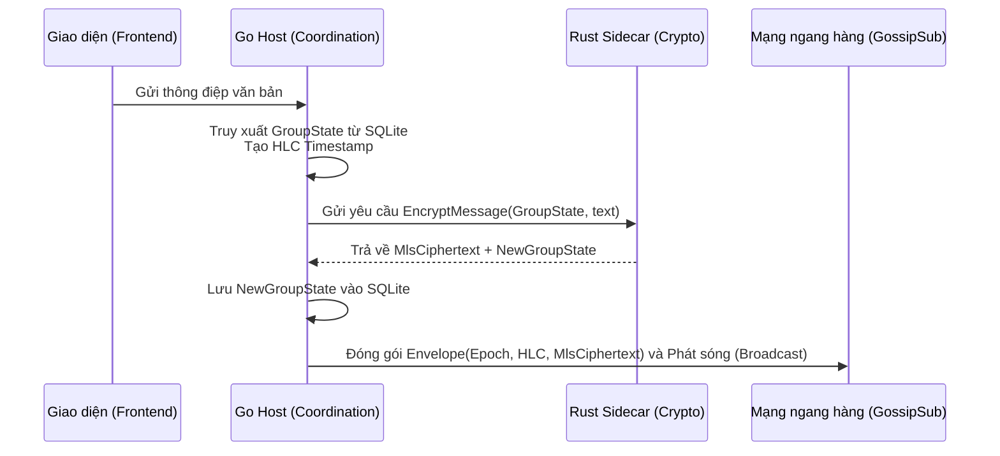

# CHƯƠNG 3: PHƯƠNG PHÁP ĐỀ XUẤT

## 3.1. Tổng quan giải pháp

Để giải quyết bài toán giao tiếp an toàn, bảo mật và phân tán hoàn toàn trên mạng lưới ngang hàng (P2P), cốt lõi của giải pháp là thiết kế **Giao thức Phối hợp phi tập trung (Decentralized Coordination Protocol)** bao bọc bên ngoài tiêu chuẩn Messaging Layer Security (MLS - RFC 9420). 

Trong mô hình MLS tiêu chuẩn, một dịch vụ phân phối trung tâm (Delivery Service) được giả định tồn tại để sắp xếp thứ tự các thao tác thay đổi trạng thái và giải quyết xung đột (concurrent commits). Việc loại bỏ hoàn toàn Delivery Service trong môi trường P2P gây ra rủi ro phân nhánh cây trạng thái (DAG forking) và phá vỡ cấu trúc giao thức. Giải pháp đề xuất không thay đổi logic mật mã lõi của MLS mà đóng gói nó bên trong một lớp phối hợp phi tập trung nhằm duy trì tính nhất quán nhân quả (causal consistency) và thứ tự toàn cục (total ordering).

### 3.1.1. Kiến trúc hệ thống Two-Tier (Go Host & Rust Sidecar)
Hệ thống được thiết kế theo mô hình **Local-First, Sidecar Architecture** nhằm đảm bảo hiệu năng và sự cô lập về bảo mật. Sự tách biệt diễn ra ở hai tiến trình chạy độc lập giao tiếp qua gRPC:

- **Lớp Phối hợp và Mạng lưới (Go Host):** Quản lý UI, mạng P2P (Libp2p, GossipSub), lưu trữ cục bộ SQLite và thuật toán phối hợp phân tán.
- **Lớp Mật mã (Rust OpenMLS Engine Sidecar):** Là tiến trình chạy nền hoàn toàn "không trạng thái" (Stateless). Nó chỉ nhận trạng thái từ Go, tính toán mật mã chuẩn MLS và trả lại kết quả.

### 3.1.2. Luồng hoạt động tổng thể
Biểu đồ sau mô tả luồng dữ liệu cơ bản khi người dùng gửi thông điệp trong nhóm:



## 3.2. Thuật toán phối hợp Single-Writer (Bầu chọn Token Holder)

Thay vì giải quyết xung đột sau khi có nhiều nút cùng Commit đồng thời (Concurrent Commits), hệ thống **loại bỏ khả năng xảy ra xung đột** bằng cách đảm bảo tại một kỷ nguyên (Epoch) nhất định, chỉ có duy nhất một nút được quyền phát hành Commit, gọi là **Epoch Token Holder**.

Việc bầu chọn Token Holder sử dụng cơ chế đồng thuận ngầm (Implicit Election), trong đó mọi nút tự tính toán dựa trên một hàm băm tất định, không cần trao đổi thông điệp bỏ phiếu trên mạng.

**Thuật toán 1: Bầu chọn Token Holder**
```text
Thuật toán: ComputeTokenHolder
Đầu vào: 
  - activeView: Danh sách các thành viên đang trực tuyến (PeerID[])
  - epoch: Số kỷ nguyên hiện tại (uint64)
Đầu ra: 
  - holderID: Định danh của Token Holder (PeerID)

Bắt đầu:
  Nếu activeView rỗng thì Trả về Lỗi "NoActiveView"
  
  bestID = null
  bestHash = max_hash_value

  Chuyển epoch thành mảng 8 bytes theo chuẩn Little Endian (epochBytes)

  Với mỗi peerID trong activeView thực hiện:
    // Nối peerID với epochBytes
    data = nối(peerID, epochBytes)
    
    // Tính hàm băm SHA-256
    candidateHash = SHA256(data)
    
    // So sánh thứ tự từ điển (lexicographical)
    Nếu candidateHash < bestHash thì:
      bestID = peerID
      bestHash = candidateHash
      
  Trả về bestID
Kết thúc
```

**Giải thích luồng thực thi:**
1. Mọi nút muốn tạo đề xuất (Proposal) như Add/Remove thành viên đều gửi Proposal qua mạng Gossip.
2. Chỉ Token Holder của kỷ nguyên hiện tại thu thập các Proposal này, xử lý qua Rust Sidecar để sinh ra một Commit hợp lệ.
3. Token Holder phát sóng Commit. Khi Commit được áp dụng bởi mạng lưới, $epoch$ tăng lên $E+1$, kết quả hàm băm tự động thay đổi, đẩy quyền Token Holder sang một nút ngẫu nhiên mới.
4. **Failover (Chuyển tiếp lỗi):** Nếu Token Holder bị mất mạng, nó sẽ bị loại khỏi `activeView` của các nút khác. Hệ thống tự chạy lại thuật toán với `activeView` mới để bầu Holder thay thế.

## 3.3. Giao thức kiểm tra tính nhất quán kỷ nguyên (Epoch Consistency)

Để đảm bảo an toàn cho cây trạng thái (Ratchet Tree), mọi thao tác MLS phải được áp dụng một cách tuyến tính. Giao thức đính kèm biến $epoch$ của nút gửi vào mọi thông điệp gửi đi. Lớp phối hợp kiểm tra tính nhất quán trước khi chuyển cho Rust Sidecar xử lý.

**Thuật toán 2: Xử lý thông điệp theo Epoch**
```text
Thuật toán: ProcessIncomingEnvelope
Đầu vào:
  - env: Gói tin nhận được chứa (epoch, hlc_timestamp, payload)
  - localEpoch: Số kỷ nguyên hiện tại của hệ thống cục bộ

Bắt đầu:
  Nếu env.epoch == localEpoch:
    // Trạng thái đồng nhất, an toàn để xử lý
    Giải mã payload thông qua Rust Sidecar
    Lưu trạng thái mới và hiển thị tin nhắn

  Ngược lại, nếu env.epoch < localEpoch:
    // Tin nhắn cũ (stale) do nghẽn mạng, nhánh cục bộ đã tiến hóa
    Từ chối xử lý thông điệp
    Gửi thông báo CurrentEpochNotification(localEpoch) trả lại cho người gửi
    
  Ngược lại, nếu env.epoch > localEpoch:
    // Tin nhắn tương lai (future), nút cục bộ bị trễ đồng bộ
    Đưa env vào hàng đợi đệm (buffer)
    Kích hoạt yêu cầu State Sync từ mạng lưới để cập nhật trạng thái nhóm

Kết thúc
```
**Minh họa:** Việc kiểm tra chặt chẽ này ngăn chặn triệt để lỗ hổng tráo đổi trạng thái hoặc lặp lại thông điệp cũ (Replay Attacks), đảm bảo các thao tác mật mã không bị giải mã sai lệch dẫn tới từ chối dịch vụ.

## 3.4. Cơ chế Phục hồi phân mảnh mạng lưới (Fork Healing)

Môi trường P2P thiếu độ tin cậy thường xuyên gặp hiện tượng đứt gãy mạng (Network Partitions). Các phân mảnh này sẽ tiến hóa song song thành các cây trạng thái khác nhau (Split-brain). Cơ chế Fork Healing có nhiệm vụ phát hiện và tự động hội tụ mạng lưới.

**Thuật toán 3: Hàm tính trọng số nhánh (Branch Weight)**
```text
Thuật toán: CompareBranchWeight
Đầu vào:
  - local: Trạng thái cục bộ (MemberCount, Epoch, CommitHash, TreeHash)
  - remote: Trạng thái từ mạng nhận qua Heartbeat

Bắt đầu:
  Nếu local.TreeHash == remote.TreeHash:
    Trả về BranchEqual // Không có phân mảnh

  Nếu local.MemberCount != remote.MemberCount:
    Trả về nhánh có MemberCount lớn hơn // Ưu tiên bảo vệ số đông
    
  Nếu local.Epoch != remote.Epoch:
    Trả về nhánh có Epoch lớn hơn // Ưu tiên nhánh tiến hóa dài hơn
    
  // Tie-breaker tất định: So sánh Byte từ điển của CommitHash
  cmp = CompareBytes(local.CommitHash, remote.CommitHash)
  Nếu cmp < 0: Trả về BranchLocal
  Ngược lại: Trả về BranchRemote
Kết thúc
```

**Quy trình hội tụ:**
1. **Phát hiện:** Các nút định kỳ phát sóng `GroupStateAnnouncement`. Nếu nhận thấy TreeHash khác nhau, thuật toán 3 sẽ được gọi để xác định "Nhánh thắng" (Winning Branch).
2. **External Join:** Các nút thuộc "Nhánh thua" hủy bỏ toàn bộ cây trạng thái hiện tại. Chúng xác minh chữ ký chứng chỉ X.509 của Nhánh thắng và thực hiện quy trình gia nhập ngoại lai (External Join) để đồng bộ.
3. **Autonomous Replay (Phát lại tự chủ):** Các nút gia nhập nhánh thắng thực hiện mã hóa và phát lại những tin nhắn văn bản chưa được đồng bộ thuộc nhánh cũ. Chú ý: *mỗi nút chỉ tự động phát lại tin nhắn do chính mình tạo ra* nhằm bảo đảm tính ẩn danh tiến về phía trước (Forward Secrecy).

## 3.5. Thuật toán Đồng hồ Logic Lai (HLC) cho định tuyến thông điệp

Kỷ nguyên (Epoch) sắp xếp các sự kiện thay đổi trạng thái mật mã nhưng không thể bảo đảm thứ tự cho tin nhắn ứng dụng thông thường gửi đi trong cùng một epoch. Sử dụng thời gian vật lý cục bộ ($time.Now()$) sẽ dẫn tới sai lệch hiển thị (clock skew) giữa các thiết bị.

Hệ thống sử dụng Đồng hồ Logic Lai (Hybrid Logical Clock - HLC) gồm ba thành phần $(L, C, NodeID)$, trong đó $L$ là thời gian vật lý cục bộ, $C$ là bộ đếm sự kiện đồng thời, và $NodeID$ là khóa phân giải xung đột.

**Thuật toán 4: Tạo Timestamp khi Gửi Tin (HLC.Now)**
```text
Thuật toán: HLC_Now
Bắt đầu:
  pt = Lấy thời gian vật lý cục bộ hiện tại (ms)
  
  Nếu pt > hlc.L:
    // Đồng hồ vật lý chạy bình thường
    hlc.L = pt
    hlc.C = 0
  Ngược lại:
    // Xảy ra nhiều sự kiện trong cùng 1 mili-giây, hoặc đồng hồ bị lùi
    Nếu hlc.C >= MAX_COUNTER:
      Đợi 1 mili-giây
      pt = Lấy lại thời gian vật lý
      hlc.L = max(hlc.L + 1, pt)
      hlc.C = 0
    Ngược lại:
      hlc.C = hlc.C + 1
      
  Trả về (hlc.L, hlc.C, NodeID)
Kết thúc
```

**Thuật toán 5: Cập nhật Timestamp khi Nhận Tin (HLC.Update)**
```text
Thuật toán: HLC_Update
Đầu vào:
  - msgHLC: HLC gắn trên tin nhắn nhận được (msg.L, msg.C, msg.NodeID)
Bắt đầu:
  pt = Lấy thời gian vật lý cục bộ hiện tại (ms)
  
  // Ngăn chặn Clock Drift (phát hiện giả mạo đồng hồ)
  Nếu (msg.L - pt) > MAX_DRIFT_MS:
    Trả về Lỗi "Clock Drift Limit Exceeded"
    
  newL = max(hlc.L, msg.L, pt)
  
  Nếu newL == hlc.L và newL == msg.L:
    hlc.C = max(hlc.C, msg.C) + 1
  Ngược lại, nếu newL == hlc.L:
    hlc.C = hlc.C + 1
  Ngược lại, nếu newL == msg.L:
    hlc.C = msg.C + 1
  Ngược lại:
    hlc.C = 0
    
  hlc.L = newL
  Trả về HLC mới
Kết thúc
```

Nhờ cơ chế HLC, giao thức đạt được **Tính nhất quán nhân quả** (causal consistency) - mọi thao tác trả lời (reply) luôn luôn hiển thị sau tin nhắn gốc, và **Thứ tự toàn cục** (total ordering) - hiển thị đồng nhất tuyệt đối trên máy của mọi người dùng dù không cần máy chủ trung tâm.
